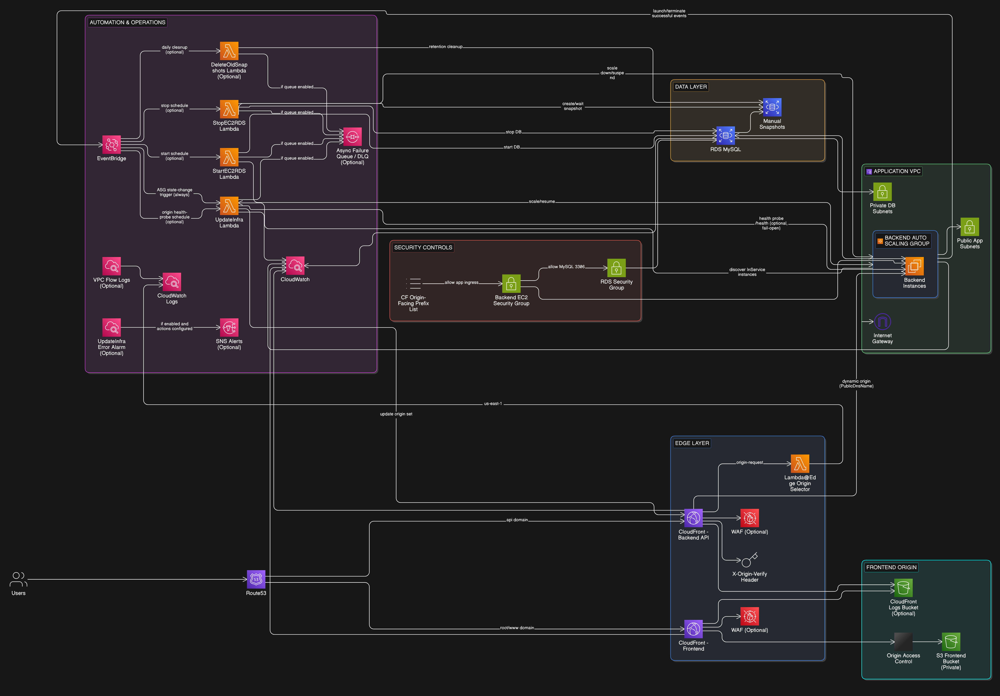

# EcoAuto AWS Terraform

This is my terraform project that provisions a modular, cost-optimized, auto-scaled, and resilient AWS infrastructure. It is composed of multiple reusable Terraform modules for EC2 with Auto Scaling, RDS MySQL, private S3 static hosting, CloudFront (frontend and backend distributions with Lambda@Edge), IAM roles, security groups (CloudFront origin-facing managed prefix list), and EventBridge automation for lifecycle and routing management using serverless Lambda functions.

It does NOT include any application-specific code or business logic. It is designed to be plugged into a wide range of backend/frontend use cases.

> ⚡️ **Lambda@Edge for backend origin routing**
> This module uses a low-cost Lambda@Edge function to dynamically route CloudFront requests to running EC2 instances (dynamic origins via `PublicDnsName`). While it's a cost-effective alternative to using an Application Load Balancer (ALB), using ALB is still the recommended option for production-grade systems requiring robust health checks and native load balancing.

* [EcoAuto AWS Terraform](#ecoauto-aws-terraform)
  * [Architecture](#architecture)
  * [Features](#features)
  * [Prerequisites](#prerequisites)
  * [Installation](#installation)
  * [Usage](#usage)
  * [Resource Types](#resource-types)
  * [Lambda Functions Explained](#lambda-functions-explained)
  * [IAM Roles & Permissions](#iam-roles--permissions)
  * [Inputs](#inputs)
  * [Outputs](#outputs)
  * [Deployment Notes](#%EF%B8%8F-deployment-notes)
  * [License](#license)
  * [Authors](#authors)

## Architecture



**High-level request flows**

* Frontend: Users → Route53 → CloudFront (Frontend) → OAC → Private S3 bucket
* Backend: Users → Route53 → CloudFront (Backend API) → Lambda@Edge (origin selector) → EC2 instances (ASG)

**Control plane (automation)**

* EventBridge triggers `update_infra` on ASG launch/terminate success events (always)
* Optional scheduled reconciliation/health probe of origins
* Optional scheduled start/stop for ASG + RDS
* Optional daily snapshot cleanup

## Features

These modules provide a flexible and automated foundation for hosting cost-efficient applications using EC2 and RDS, with global delivery via CloudFront.

* Scheduled RDS and EC2 start/stop with Lambda + EventBridge *(optional by config)*
* EC2 Auto Scaling with CPU-based policies
* Private S3 static hosting with CloudFront (**OAC secured**)
* Lambda@Edge-based origin switching for backend EC2 (low-cost ALB alternative)
* Backend CloudFront origins are **maintained dynamically** by `update_infra` (dynamic origins via `PublicDnsName`)
* IAM roles and policies are designed to follow the least-privilege principle for all services, including Lambda and EC2
* Backend ingress restricted to **CloudFront origin-facing managed prefix list** (no “CloudFront IP fetch” Lambda required)
* Optional origin authentication via CloudFront custom header (**`X-Origin-Verify`** by default)
* Two-header origin-auth rotation window supported (`X-Origin-Verify` + `X-Origin-Verify-Prev`)
* Route53 alias records for frontend/backend
* Optional snapshot retention cleanup Lambda + schedule
* Optional SQS async failure queue / DLQ for Lambda failures
* Optional observability add-ons (CloudFront access logs bucket, VPC Flow Logs)

> Lambda functions are triggered via EventBridge rules (start/stop schedules, optional health probe schedules) and ASG lifecycle events to update backend routing dynamically.

> ℹ️ In the default public-origin profile (CloudFront prefix-list SG), `enable_origin_health_probe` is disabled by default because direct Lambda-to-origin probes are not reachable unless you explicitly design ingress for them.

## Prerequisites

Before you start using this project, ensure you have the following prerequisites set up and ready:

* **AWS Account**: You need an active AWS account. Sign up or log in at [AWS Management Console](https://aws.amazon.com/console/).
* **Terraform Installed**: Install Terraform (**version 1.8.x recommended**, `< 2.0.0`). Download it from [Terraform's official site](https://www.terraform.io/downloads).
* **AWS CLI Installed** *(Optional but recommended)*: For managing AWS credentials and services. See [AWS CLI installation guide](https://docs.aws.amazon.com/cli/latest/userguide/install-cliv2.html).
* **Git**: For cloning the repository and version control. [Install Git](https://git-scm.com/book/en/v2/Getting-Started-Installing-Git) if you haven't already.
* **Route 53 Hosted Zone**: You must own a domain and have a **public hosted zone** (you will provide `route53_zone_id`).
* **ACM certificates (mandatory)**: You need **two ACM cert ARNs** created in **us-east-1** for CloudFront:

  * `acm_cert_frontend`
  * `acm_cert_backend`
* **CloudFront policy IDs (mandatory for backend)**:

  * `backend_cache_policy_id`
  * `backend_origin_request_policy_id`
  * Recommended AWS managed defaults for APIs:

    * Cache policy **CachingDisabled**: `4135ea2d-6df8-44a3-9df3-4b5a84be39ad`
    * Origin request policy **AllViewer**: `216adef6-5c7f-47e4-b989-5492eafa07d3`

## Installation

### 1. Clone the repo

```bash
git clone https://github.com/firassBenNacib/EcoAuto_AWS_Terraform.git
cd EcoAuto_AWS_Terraform
```

### 2. Terraform init (remote state recommended)

If you use S3 remote state:

```bash
cp backend.hcl.example backend.hcl
terraform init -reconfigure -backend-config=backend.hcl
```

If you don’t use remote state, a normal init works:

```bash
terraform init
```

### 3. Create a tfvars file

Start from an example:

```bash
cp terraform.dev.tfvars.example terraform.dev.tfvars
```
or

```bash
cp terraform.prod.tfvars.example terraform.prod.tfvars
```

At minimum, set:

* Domains: `workspace_domain` (workspace mode) **or** `frontend_domain`/`backend_domain` (template mode)
* `route53_zone_id`
* `acm_cert_frontend`, `acm_cert_backend` (must be us-east-1)
* Backend: `ec2_ami_id` and `user_data_script` (see `modules/ec2/user-data/your-user-data-script.sh`; `backend_port` defaults to `8080`)
* CloudFront policies: `backend_cache_policy_id`, `backend_origin_request_policy_id`
* S3: `bucket_name`
* DB: `rds_username` / `rds_password` (recommended via env vars below)

### 4. Provide DB credentials (recommended via env vars)

```bash
export TF_VAR_rds_username="your_db_user"
export TF_VAR_rds_password="your_db_password"
```

## Usage

### Deploy (workspace mode)

```bash
terraform workspace select dev || terraform workspace new dev
terraform plan  -var-file=terraform.dev.tfvars
terraform apply -var-file=terraform.dev.tfvars
```

### Deploy (template mode)

Set `compatibility_mode = "template"` in your tfvars and run:

```bash
terraform plan  -var-file=terraform.tfvars
terraform apply -var-file=terraform.tfvars
```

## Resource Types

* aws_vpc
* aws_subnet
* aws_internet_gateway
* aws_route_table
* aws_autoscaling_group
* aws_launch_template
* aws_db_instance
* aws_db_subnet_group
* aws_s3_bucket
* aws_cloudfront_origin_access_control
* aws_cloudfront_distribution
* aws_lambda_function
* aws_iam_role
* aws_security_group
* aws_cloudwatch_event_rule
* aws_cloudwatch_log_group
* aws_route53_record
* aws_sqs_queue *(optional)*
* aws_sns_topic *(optional)*
* Optional WAF Web ACL association via CloudFront `web_acl_id` (`frontend_web_acl_arn`, `backend_web_acl_arn`)

## Lambda Functions Explained

| Function                                    | Description                                                                                                                         | Trigger                                        |
| ------------------------------------------- | ----------------------------------------------------------------------------------------------------------------------------------- | ---------------------------------------------- |
| `UpdateInfraRouting` (`update_infra`)       | Discovers InService EC2 instances in the ASG and updates the backend CloudFront distribution origin set (and origin custom headers) | EventBridge (ASG lifecycle), optional schedule |
| `StartComputeResources` (`start_instances`) | Starts/scales up the ASG and starts the RDS instance (for scheduled uptime)                                                         | EventBridge (cron)                             |
| `StopComputeResources` (`stop_instances`)   | Scales down/suspends the ASG, creates/waits snapshot (optional), and stops the RDS instance                                         | EventBridge (cron)                             |
| `DeleteSnapshots` (`delete_old_snapshots`)  | Cleans up old manual RDS snapshots based on retention settings                                                                      | EventBridge (cron, optional)                   |
| `EdgeOriginSelector` (Lambda@Edge)          | Selects an origin based on `x-origin-list` header set by `update_infra` for stable routing                                          | CloudFront (origin-request)                    |

## IAM Roles & Permissions

This project provisions several IAM roles to follow the least-privilege principle and enable secure execution of EC2, Lambda, and CloudFront tasks:

* `ec2_basic_role`: EC2 read-only + SSM role attached to instances in the Auto Scaling Group
* `scheduler_lambda_role`: Manages ASG/RDS lifecycle (start/stop, scale, optional snapshot create/delete)
* `lambda_edge_role`: Required for Lambda@Edge functions invoked by CloudFront origin requests
* `infra_update_lambda_role`: Updates backend CloudFront distribution origin configuration (dynamic origins + custom headers)

## Inputs

Authoritative source: [`variables.tf`](./variables.tf).
The table below highlights the most important inputs for deployment.

| Name                               | Description                                                                | Type         | Default               | Required |
| ---------------------------------- | -------------------------------------------------------------------------- | ------------ | --------------------- | -------- |
| compatibility_mode                 | Deployment mode (`workspace` or `template`)                               | string       | `"template"`          | no       |
| workspace_domain                   | Base domain used when `compatibility_mode = "workspace"`                  | string       | `""`                  | conditional |
| workspace_backend_subdomain        | Backend subdomain prefix in workspace mode                                | string       | `"api"`               | no       |
| use_default_vpc                    | Use default VPC/subnets instead of creating a dedicated VPC               | bool         | `false`               | no       |
| allow_default_vpc_outside_prod     | Allow default VPC usage in non-prod workspaces                            | bool         | `true`                | no       |
| availability_zones                 | AZ list used for dedicated VPC subnets                                    | list(string) | `[]`                  | conditional |
| public_app_subnet_cidrs            | Public app subnet CIDRs (dedicated VPC mode)                              | list(string) | `[]`                  | conditional |
| private_db_subnet_cidrs            | Private DB subnet CIDRs (dedicated VPC mode)                              | list(string) | `[]`                  | conditional |
| ec2_ami_id                         | AMI ID for backend EC2 instances                                          | string       | n/a                   | yes      |
| instance_type                      | EC2 instance type                                                         | string       | `"t4g.micro"`         | no       |
| desired_capacity / min_size / max_size | ASG scaling bounds and target desired count                           | number       | `1 / 1 / 2`           | no       |
| backend_port                       | Backend application port                                                  | number       | `8080`                | no       |
| backend_origin_protocol_policy     | CloudFront-to-origin protocol (`http-only` or `https-only`)              | string       | `"http-only"`         | no       |
| backend_ignore_dynamic_origin_drift| Ignore origin drift managed by `update_infra` Lambda                      | bool         | `true`                | no       |
| enable_origin_auth_header          | Enable backend origin custom-header authentication                        | bool         | `true`                | no       |
| origin_auth_header_value           | Primary origin auth secret value                                          | string       | `""`                  | conditional |
| acm_cert_frontend                  | ACM cert ARN for frontend CloudFront (must be in us-east-1)              | string       | n/a                   | yes      |
| acm_cert_backend                   | ACM cert ARN for backend CloudFront (must be in us-east-1)               | string       | n/a                   | yes      |
| backend_cache_policy_id            | CloudFront cache policy ID for backend distribution                       | string       | n/a                   | yes      |
| backend_origin_request_policy_id   | CloudFront origin request policy ID for backend distribution              | string       | n/a                   | yes      |
| route53_zone_id                    | Route 53 public hosted zone ID                                            | string       | n/a                   | yes      |
| bucket_name                        | Frontend S3 bucket name                                                   | string       | n/a                   | yes      |
| rds_username / rds_password        | RDS master credentials                                                    | string       | n/a                   | yes      |
| rds_instance_class                 | RDS instance class                                                        | string       | `"db.t4g.micro"`      | no       |
| enable_compute_start_stop_schedule | Enable scheduled start/stop automation (ASG + RDS)                        | bool         | `true`                | no       |
| start_schedule_expression          | EventBridge cron for start automation                                     | string       | `cron(0 7 * * ? *)`   | no       |
| stop_schedule_expression           | EventBridge cron for stop automation                                      | string       | `cron(0 1 * * ? *)`   | no       |
| enable_snapshot_cleanup            | Enable scheduled manual snapshot retention cleanup Lambda                 | bool         | `true`                | no       |
| enable_origin_health_probe         | Enable scheduled direct-origin health probe in `update_infra`             | bool         | `false`               | no       |

> 💡 By default this project can create a **dedicated VPC** (public app subnets + private DB subnets).
> You can use the **default VPC** for faster non-prod setup by setting `use_default_vpc=true` (recommended outside prod only).

> 🐳 **User-data Script**
> Update the `modules/ec2/user-data/your-user-data-script.sh` script with your container image / runtime before deployment.

## Outputs

Authoritative source: [`outputs.tf`](./outputs.tf).

| Name                               | Description                                                               |
| ---------------------------------- | ------------------------------------------------------------------------- |
| vpc_id                             | Selected VPC ID used by the deployment                                    |
| public_app_subnet_ids              | Public app subnet IDs used by backend EC2                                 |
| db_subnet_ids                      | DB subnet IDs used by RDS                                                 |
| backend_cloudfront_url             | Backend CloudFront distribution domain name                               |
| backend_cloudfront_distribution_id | Backend CloudFront distribution ID used by `update_infra`                 |
| frontend_cloudfront_url            | Frontend CloudFront distribution domain name                              |
| rds_endpoint                       | RDS endpoint                                                              |
| ec2_asg_name                       | EC2 Auto Scaling Group name                                               |
| backend_ec2_security_group_id      | Backend EC2 security group ID                                             |
| cloudfront_origin_prefix_list_id   | CloudFront origin-facing managed prefix list ID                           |
| cloudfront_origin_prefix_list_max_entries | Max entries/weight of CloudFront managed prefix list                 |
| rds_security_group_id              | RDS security group ID                                                     |
| snapshot_cleanup_lambda_arn        | Snapshot cleanup Lambda ARN (optional)                                    |
| origin_health_probe_rule_name      | EventBridge rule name for scheduled health probing (optional)             |
| update_infra_error_alarm_name      | CloudWatch alarm name for update-infra Lambda errors (optional)           |
| update_infra_alarm_sns_topic_arn   | SNS topic ARN for update-infra alarm notifications (optional)             |
| lambda_async_failure_queue_arn     | Shared SQS queue ARN for async Lambda failures / EventBridge DLQ (optional) |
| update_infra_invoke_command        | CLI runbook command to invoke `update_infra` manually                     |
| cloudfront_logs_bucket_name        | CloudFront access logs bucket name (optional)                             |
| vpc_flow_logs_log_group_name       | VPC Flow Logs CloudWatch log group name (optional)                        |

## ⚠️ Deployment Notes

> ✅ Please read carefully before deploying to ensure a smooth setup.

### 1. Domain and Route 53 Setup

* You must own a domain name and have a public hosted zone created in Route 53.
* Update the following input variables accordingly:

  * `route53_zone_id` - your hosted zone ID
  * Workspace mode: set `workspace_domain` and keep `workspace_backend_subdomain` (default `api`)
  * Template mode: set `frontend_domain` and `backend_domain` (e.g., `example.com`, `api.example.com`)
* The backend CloudFront alias must match the domain you plan to use for routing.

### 2. Lambda@Edge Deployment Region

> **Note:** Lambda@Edge functions must be deployed in `us-east-1`, even if your infrastructure is in another region.
> This is handled in this project via a dedicated provider block with alias `us_east_1`.

Make sure ACM certificates for both frontend and backend CloudFront distributions are also created in `us-east-1`.

### 3. Backend CloudFront policy IDs

The backend CloudFront distribution requires:

* `backend_cache_policy_id`
* `backend_origin_request_policy_id`

Recommended AWS managed defaults for APIs:

* Cache policy **CachingDisabled**: `4135ea2d-6df8-44a3-9df3-4b5a84be39ad`
* Origin request policy **AllViewer**: `216adef6-5c7f-47e4-b989-5492eafa07d3`

### 4. Default VPC vs Dedicated VPC

* Dedicated VPC is the recommended “production” topology (public app subnets + private DB subnets).
* `use_default_vpc=true` is intended for non-prod / quick setup only.

### 5. Manual Upload for Frontend Static Files (S3)

This project provisions the S3 bucket and sets permissions, but it does not upload your website files.

You need to upload them manually or use a script after `terraform apply` completes.

To upload files to S3 using the AWS CLI:

```bash
aws s3 sync ./dist/ s3://your-s3-bucket-name/ --delete
```

## License

This project is licensed under the [MIT License](./LICENSE).

## Authors

Created and maintained by [Firas Ben Nacib](https://github.com/firassBenNacib) - [bennacibfiras@gmail.com](mailto:bennacibfiras@gmail.com)
